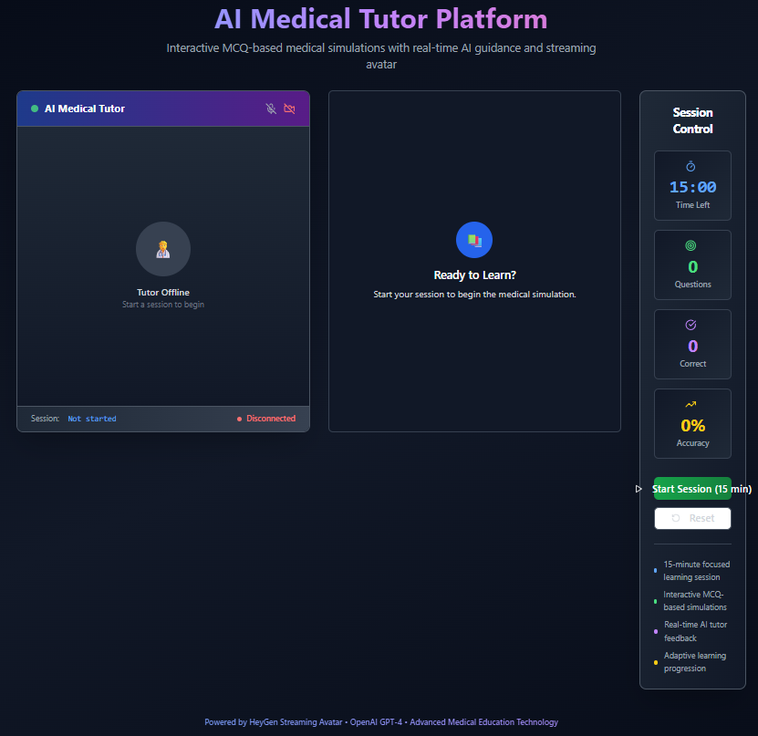

# 🧑‍⚕️ AI Medical Tutor Platform

> An innovative AI-powered medical education platform featuring interactive MCQ simulations with real-time streaming avatar feedback

[](https://reactjs.org/)
[](https://www.typescriptlang.org/)
[](https://vitejs.dev/)
[](https://tailwindcss.com/)
[](https://opensource.org/licenses/MIT)

## 📸 Dashboard Preview



## 🌟 Features

### 🎯 **Interactive Learning Experience**
- **15-minute timed learning sessions** with comprehensive progress tracking
- **MCQ-based medical simulations** covering multiple medical specialties
- **Real-time AI feedback** with adaptive learning progression
- **Performance analytics** including accuracy metrics and detailed statistics

### 🤖 **AI-Powered Avatar Integration**
- **HeyGen Streaming Avatar** technology for realistic AI tutor interaction
- **WebRTC streaming** for seamless real-time video communication
- **Natural speech synthesis** for question delivery and personalized feedback
- **Visual status indicators** for avatar connection and speaking states

### 🧠 **Intelligent Content Generation**
- **OpenAI GPT-4 integration** for dynamic explanation generation
- **Adaptive feedback system** based on individual performance patterns
- **Personalized learning recommendations** tailored to knowledge gaps
- **Context-aware medical explanations** for enhanced understanding

### 📚 **Comprehensive Question Bank**
- **Curated medical questions** across key specialties:
  - 🫀 **Cardiology** - Heart and cardiovascular system
  - 🚨 **Emergency Medicine** - Critical care scenarios
  - 🧬 **Endocrinology** - Hormonal and metabolic disorders
  - 🧠 **Neurology** - Nervous system conditions
- **Multiple difficulty levels**: Beginner, Intermediate, Advanced
- **Detailed explanations** with clinical reasoning for each question

## 🚀 Getting Started

### Prerequisites

- **Node.js** (v18 or higher) - [Download here](https://nodejs.org/)
- **npm** or **yarn** package manager
- **Git** for version control

### Installation

1. **Clone the repository**
   ```bash
   git clone https://github.com/yourusername/nextlpc-interactive-demo.git
   cd nextlpc-interactive-demo
   ```

2. **Install dependencies**
   ```bash
   npm install
   # or
   yarn install
   ```

3. **Environment Setup** (Optional - for full AI features)
   ```bash
   # Create .env file in root directory
   cp .env.example .env
   
   # Add your API keys (optional - mock services work without keys)
   VITE_OPENAI_API_KEY=your_openai_api_key_here
   VITE_HEYGEN_API_KEY=your_heygen_api_key_here
   ```

4. **Start the development server**
   ```bash
   npm run dev
   # or
   yarn dev
   ```

5. **Open your browser**
   Navigate to `http://localhost:5173` to see the application running.

## 🏗️ Technical Architecture

### **Frontend Stack**
- **⚛️ React 18** with TypeScript for type-safe development
- **⚡ Vite** for lightning-fast development and optimized builds
- **🎨 shadcn/ui** component library built on Radix UI primitives
- **🎯 Tailwind CSS** for modern, responsive styling
- **🧭 React Router** for seamless navigation

### **Key Dependencies**
```json
{
  "react": "^18.3.1",
  "typescript": "^5.5.3",
  "vite": "^5.4.1",
  "@supabase/supabase-js": "^2.50.0",
  "@tanstack/react-query": "^5.56.2",
  "tailwindcss": "^3.4.11"
}
```

### **External Integrations**
- **🎭 HeyGen Streaming Avatar API** - Real-time avatar interaction
- **🤖 OpenAI GPT-4 API** - Intelligent content generation
- **🗄️ Supabase** - Database and backend services (configured)

## 📁 Project Structure

```
nextlpc-interactive-demo/
├── src/
│   ├── components/          # React components
│   │   ├── AvatarContainer.tsx    # HeyGen avatar integration
│   │   ├── MCQInterface.tsx       # Question interface
│   │   ├── SessionControl.tsx     # Session management
│   │   └── ui/                    # shadcn/ui components
│   ├── hooks/               # Custom React hooks
│   │   ├── useSession.ts          # Session state management
│   │   ├── useQuestions.ts        # Question flow logic
│   │   └── useServices.ts         # API service coordination
│   ├── services/            # External API integrations
│   │   ├── heyGenService.ts       # HeyGen avatar service
│   │   └── openAIService.ts       # OpenAI integration
│   ├── data/                # Static data and types
│   │   └── medicalQuestions.ts    # Question bank
│   └── pages/               # Application pages
├── public/                  # Static assets
├── supabase/               # Database configuration
└── Dashboard.png           # Application screenshot
```

## 🎮 Usage

### **Starting a Learning Session**
1. Click **"Start Session"** to begin a 15-minute learning session
2. The AI avatar will initialize and greet you
3. Answer MCQ questions as they appear
4. Receive real-time feedback and explanations
5. Track your progress with live statistics

### **Interactive Features**
- **Real-time Avatar Feedback**: Get personalized encouragement and explanations
- **Adaptive Learning**: System adjusts based on your performance patterns
- **Progress Tracking**: Monitor accuracy, questions answered, and time remaining
- **Session Analytics**: Comprehensive feedback at session completion

## 🔧 Configuration

### **API Keys Setup** (Optional)
The application works with mock services by default. For full AI features:

1. **OpenAI API Key**: Get from [OpenAI Platform](https://platform.openai.com/)
2. **HeyGen API Key**: Get from [HeyGen Platform](https://www.heygen.com/)

Add to `.env` file:
```env
VITE_OPENAI_API_KEY=sk-your-openai-key
VITE_HEYGEN_API_KEY=your-heygen-key
```

### **Customization Options**
- **Session Duration**: Modify in `useSession.ts`
- **Question Bank**: Add questions in `medicalQuestions.ts`
- **Avatar Configuration**: Update in `useServices.ts`
- **UI Theme**: Customize in `tailwind.config.ts`

## 🚀 Deployment

### **Build for Production**
```bash
npm run build
# or
yarn build
```

### **Preview Production Build**
```bash
npm run preview
# or
yarn preview
```

### **Deploy to Vercel/Netlify**
1. Connect your GitHub repository
2. Set build command: `npm run build`
3. Set publish directory: `dist`
4. Add environment variables if using real API keys

## 🤝 Contributing

We welcome contributions! Please see our [Contributing Guidelines](CONTRIBUTING.md) for details.

### **Development Workflow**
1. Fork the repository
2. Create a feature branch: `git checkout -b feature/amazing-feature`
3. Commit changes: `git commit -m 'Add amazing feature'`
4. Push to branch: `git push origin feature/amazing-feature`
5. Open a Pull Request

## 📄 License

This project is licensed under the MIT License - see the [LICENSE](LICENSE) file for details.

## 🙏 Acknowledgments

- **HeyGen** for streaming avatar technology
- **OpenAI** for GPT-4 integration
- **shadcn/ui** for beautiful UI components
- **Radix UI** for accessible primitives
- **Tailwind CSS** for utility-first styling

## 📞 Support

For support, email [your-email@example.com] or create an issue in this repository.

---

<div align="center">
  <p>Built with ❤️ for medical education</p>
  <p>
    <a href="#-ai-medical-tutor-platform">Back to top</a>
  </p>
</div>
